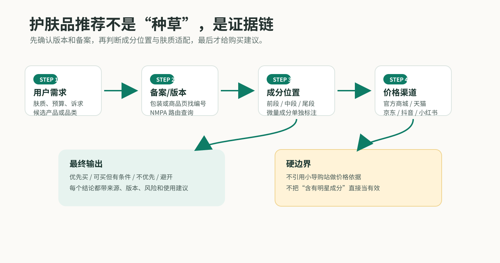
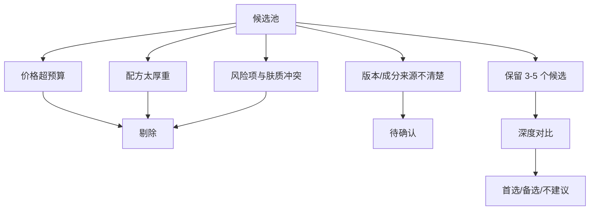
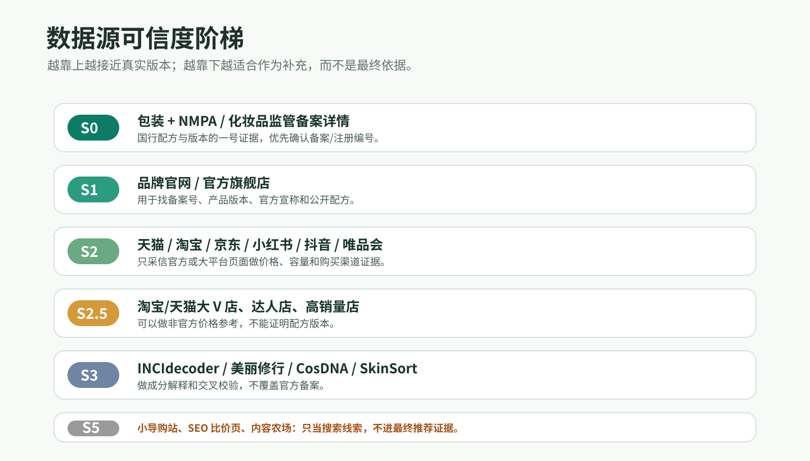
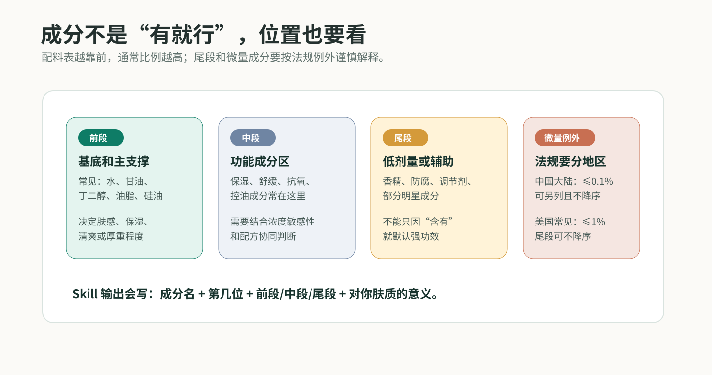

# 护肤品配料表选品 Skill

一个帮你把护肤品“成分表、价格、肤质适配、风险项”放在同一张桌子上比较的 Codex Skill。

它不是简单查成分，也不是看谁营销词更漂亮。它会先确认这瓶产品到底是哪一个版本、成分表从哪里来，再根据你的肤质和诉求给出明确购买建议。



## 30 秒看懂

| 你想问 | Skill 会做什么 | 最终给你什么 |
| --- | --- | --- |
| `薇诺娜和玉泽润肤霜哪个好？` | 抓官方/成分库数据，比较配方结构、刺激点、肤质适配 | 明确选 A/B，附原因 |
| `混油皮，400 元以内保湿面霜选什么？` | 建候选池，排除不合适产品，排序推荐 | 首选、备选、不建议款 |
| `这个成分表适合我吗？` | 按成分位置拆功能和风险 | 适合谁、不适合谁 |
| `这几个产品哪个更值？` | 做多产品评分和价格/容量对比 | 购买优先级 |

一句话：它是一个“护肤品购买决策侦查台”，把成分、来源、价格和你的皮肤状态一起看。

## 一张图看懂流程

这个 Skill 的流程不是“先搜热门推荐”，而是：

1. 先确认用户需求和候选产品。
2. 国行产品优先找备案/注册编号，走 NMPA 或化妆品监管查询。
3. 再看成分位置、肤质风险和官方/大平台价格。
4. 最后输出明确购买动作。

## 它能干什么

### 1. 两个产品二选一

适合这种问题：

```text
我是混油皮，想买保湿面霜。薇诺娜舒敏保湿特护霜和玉泽皮肤屏障修护保湿霜哪个好？
```

输出会包含：

| 模块 | 说明 |
| --- | --- |
| 直接结论 | 更建议买谁 |
| 数据源可信度 | 官网、旗舰店、NMPA、第三方库是否一致 |
| 核心成分对比 | 保湿、修护、舒缓、控油等 |
| 风险项对比 | 香精、酒精、酸类、A 醇、厚重油脂、致痘提示 |
| 肤质适配 | 干皮、油皮、混油、敏感肌、痘肌 |
| 性价比 | 价格、容量、单位价格 |
| 购买建议 | 优先买、可买但有条件、不优先、避开 |

### 2. 按需求直接挑一个

适合这种问题：

```text
混油皮，预算 400 元以内，想买一瓶保湿面霜，不要太厚重，帮我选一个。
```

Skill 会先建立候选池，然后做排除：



### 3. 成分表审查

适合这种问题：

```text
这个配料表适合敏感肌吗？
```

它会看：

| 维度 | 重点 |
| --- | --- |
| 前 10 位成分 | 判断基底、保湿、油脂、肤感 |
| 功效成分 | 是否真的服务你的诉求 |
| 成分位置 | 第几位、前段/中段/尾段，判断是否支撑宣传 |
| 风险成分 | 是否与你的肤质/禁忌冲突 |
| 配方完整度 | 不是只看明星成分 |
| 使用场景 | 白天/晚上、夏天/冬天、妆前/屏障期 |

## 数据从哪里来

Skill 的取数优先级是：



| 优先级 | 数据源 | 作用 | 可信度 |
| --- | --- | --- | --- |
| S0 | 实物包装 + NMPA/化妆品监管备案详情 | 确认国行真实成分表、备案和版本 | 最高 |
| S1 | 品牌官网、官方旗舰店 | 找备案号、产品版本、品牌宣称 | 高 |
| S2 | 品牌官方商城、天猫/淘宝、京东、小红书、抖音、唯品会、官方有赞 | 价格、容量、渠道版本 | 中高 |
| S2.5 | 淘宝/天猫大 V 店、达人店、买手店、高销量店 | 只做非官方价格参考 | 中 |
| S3 | INCIdecoder、美丽修行、SkinSort、CosDNA、可爱网、海淘族 | 成分解释和辅助校验 | 中 |
| S4 | EU CosIng、FDA、CIR、CosmeticsInfo | 法规、功能、安全背景 | 高 |
| S5 | 小红书、知乎、电商评论 | 肤感、搓泥、闷痘、香味反馈 | 低到中 |

原则很简单：真实成分表听官方和包装的，成分解释再看第三方库。

国行产品默认先走备案号：包装、商品详情或客服拿到编号后，去国家药监局政务服务门户的 `化妆品查询` 查详情。  
编号路由如下：

| 编号包含 | 查询库 |
| --- | --- |
| `妆网备字` | 国产普通化妆品备案信息 |
| `国妆网备进字` | 进口普通化妆品备案信息 |
| `国妆特字` | 国产特殊化妆品注册信息 |
| `国妆特进字` | 进口特殊化妆品注册信息 |

可以用工具先判定：

```bash
python3 /Users/caifeiya/.codex/skills/skincare-product-selector/tools/nmpa_filing_route.py "浙G妆网备字2023001147"
```

价格源有一条硬规则：不引用乱七八糟的小网站。聚合导购站、SEO 比价页、内容农场、小商城只能当搜索线索，不能出现在最终推荐里。  
淘宝大 V 店可以买的人多，可以纳入，但要标成 `非官方高销量价格参考`，不能拿它证明配方版本。

成分排序也有一条硬规则：配料表越靠前，通常代表添加比例越高。  
但它不是精确百分比。中国大陆标签里，`≤0.1%` 的微量成分可以另列且不按降序；美国常见口径是 `≤1%` 的尾段成分可不按降序。所以分析时会写清楚活性成分在第几位、属于 `前段/中段/尾段`，而不是只说“含有某某成分”。



## 安装时依赖提示

建议安装/启用 Skill 时，同时提示这些插件：

| 插件 | 建议级别 | 用途 |
| --- | --- | --- |
| Browser | 推荐 | 渲染本地页面和公开网页，检查 README/图片 |
| Chrome | 推荐 | 读取用户已登录或已完成普通验证的可见页面 |
| Computer Use | 推荐 | 手动导航 NMPA 政务服务门户等动态官方页面 |
| Spreadsheets | 可选 | 多产品对比导出表格 |
| Documents | 可选 | 把选品结论打包成文档 |

安装后可以运行依赖检查：

```bash
cd /Users/caifeiya/.codex/skills/skincare-product-selector
python3 -m pip install -r requirements.txt
python3 -m playwright install chromium
python3 tools/check_dependencies.py
```

更完整的说明见 [INSTALL.md](INSTALL.md)，机器可读依赖清单见 [dependencies.json](dependencies.json)。

## 取数和“安全验证”怎么处理

这个 Skill 有一组取数工具。先发现和匹配页面：

```bash
python3 /Users/caifeiya/.codex/skills/skincare-product-selector/tools/source_discover.py "产品名 成分表 价格" --must 品牌,产品关键词 --browser-fallback
```

如果你已经给了明确链接，才直接用探针：

```bash
python3 /Users/caifeiya/.codex/skills/skincare-product-selector/tools/source_probe.py --browser-fallback URL...
```

它会尝试：

| 通道 | 做什么 | 适合什么情况 |
| --- | --- | --- |
| 直连 HTTP | 抓静态 HTML、价格、备案号、成分表 | 官网、品牌官方商城、部分大平台页面 |
| 浏览器渲染 | 用 Playwright 渲染普通 JS 页面 | 内容靠前端渲染的页面 |
| Chrome 用户会话 | 用你本机 Chrome 打开网页，读取你能正常看到的页面 | 登录后页面、普通安全验证后页面、CosDNA 这类不稳定页面 |
| 人工证据 | 让你提供包装图、App 截图、网页截图 | 验证码、登录、App 内数据 |

它会先做候选匹配，避免“抓到了网页，但网页不是这个产品”的错页问题。

重要边界：它不会破解验证码、绕过 Cloudflare、偷 cookie、做代理池伪装。  
但如果你可以在 Chrome 里正常打开或完成验证，它可以读取这个已授权页面里可见的成分内容。

## 真实测试结果

测试日期：2026-05-25

### 测试 1：混油皮，400 元以内保湿面霜选什么？

结论：优先推荐 `玉泽皮肤屏障修护专研清透保湿霜 50g`。

原因：

| 产品 | 抓取结果 | 适配判断 |
| --- | --- | --- |
| 玉泽清透保湿霜 | 官方有赞页抓到 `￥279.00`；可爱网抓到 26 个成分和备案号 `沪G妆网备字2023000899` | 更贴合混油皮，保湿但不走厚重路线 |
| 薇诺娜舒敏保湿特护霜 | 官网抓到 `￥268.00`、备案号和 15 个成分 | 更适合敏感、泛红、维稳，但对混油全脸日用不是最精准 |
| 玉泽经典屏障修护保湿霜 | 第三方页抓到成分；价格需回到官方/大平台确认 | 偏滋润屏障修护，混油皮可能更适合局部或秋冬 |
| 珂润润浸保湿滋润乳霜 | 花王官网抓到完整成分 | 温和基础，但对混油控厚重不如玉泽清透款精准 |

### 测试 2：薇诺娜和玉泽润肤霜哪个好？

如果你说的是 `薇诺娜舒敏保湿特护霜` 对比 `玉泽经典皮肤屏障修护保湿霜`：

| 肤质 | 更建议 |
| --- | --- |
| 混油皮日常全脸 | 薇诺娜 |
| 干敏皮、冬季、屏障明显受损 | 玉泽经典 |
| 混油但想要玉泽 | 玉泽清透保湿霜，而不是经典厚润款 |

原因：薇诺娜官方页能抓到完整成分，配方短、修护舒缓明确；玉泽经典屏障修护更偏脂质修护，油脂结构更足，对混油皮不一定是最轻松的日用选择。

## 输出长什么样

### 二选一输出

```text
更建议：A

理由：
1. A 的核心配方更贴合你的诉求。
2. B 的某些风险项和你的肤质冲突。
3. A 的数据源更可信或版本更明确。

购买建议：优先买 / 可买但有条件 / 不优先 / 避开
```

### 按需求挑选输出

```text
首选：产品 A
备选：产品 B
不建议热门款：产品 C

为什么：
- 成分逻辑
- 肤质适配
- 风险项
- 价格/容量
- 数据源可信度
```

## 文件结构

```text
skincare-product-selector/
  SKILL.md
  README.md
  INSTALL.md
  DESIGN.md
  dependencies.json
  requirements.txt
  assets/
    evidence-pipeline.svg
    source-ladder.svg
    ingredient-position.svg
    IMAGE_AUDIT.md
  tools/
    source_probe.py
    source_discover.py
    nmpa_filing_route.py
    check_dependencies.py
  references/
    source-policy.md
    crawl-playbook.md
    ingredient-risk-taxonomy.md
  templates/
    two-product-comparison.md
    need-based-selection.md
  tests/
    pressure-scenarios.md
    verification-2026-05-25.md
    discovery-fix-2026-05-25.md
    test_source_policy.py
    test_ingredient_positions.py
    test_nmpa_filing_route.py
    test_readme_assets_and_dependencies.py
```

| 文件 | 用途 |
| --- | --- |
| `SKILL.md` | Codex 触发和执行规则 |
| `DESIGN.md` | 整体方案设计 |
| `INSTALL.md` | 安装步骤、插件提示和降级策略 |
| `dependencies.json` | 机器可读的 Python/插件依赖清单 |
| `assets/` | 已审核通过的 README 图像资产 |
| `source_probe.py` | 公开页面取数探针 |
| `source_discover.py` | 搜索候选和错页拒绝 |
| `nmpa_filing_route.py` | NMPA 备案/注册编号路由 |
| `check_dependencies.py` | 安装后依赖检查 |
| `source-policy.md` | 数据源优先级 |
| `crawl-playbook.md` | 抓取、验证、失败降级策略 |
| `ingredient-risk-taxonomy.md` | 成分功能和风险分类 |
| `two-product-comparison.md` | 二选一输出模板 |
| `need-based-selection.md` | 按需求挑选输出模板 |
| `verification-2026-05-25.md` | 真实跑通记录 |
| `test_readme_assets_and_dependencies.py` | README 图片和依赖清单回归测试 |

## 你可以直接这样用

```text
对比薇诺娜舒敏保湿特护霜和玉泽皮肤屏障修护保湿霜，我是混油皮，帮我选一个。
```

```text
我是油痘肌，预算 200，想淡痘印，不要太刺激，帮我挑一个精华。
```

```text
这几个面霜哪个更适合干敏皮？请按成分表和价格排序。
```

```text
这个成分表有没有酒精、香精、酸类和闷痘风险？
```

## 它不会做什么

- 不做皮肤病诊断。
- 不承诺治疗痘痘、玫瑰痤疮、湿疹、黄褐斑。
- 不把第三方评分当成绝对真理。
- 不在没有版本证据时装作很确定。

## 最适合的使用方式

给它这 6 个信息，结果会最准：

| 信息 | 示例 |
| --- | --- |
| 肤质 | 混油、干敏、油痘、屏障受损 |
| 目标 | 保湿、修护、美白、抗老、控油 |
| 品类 | 面霜、精华、防晒、洁面 |
| 预算 | 200、400、800 |
| 禁忌 | 不要香精、不要酒精、不要酸、不要太油 |
| 候选 | 产品名、链接、截图或包装图 |

## 一句话记住

这个 Skill 的价值不是“查到了成分”，而是把“成分从哪里来、是不是当前版本、适不适合你的皮肤、值不值得买”一次性讲清楚。
